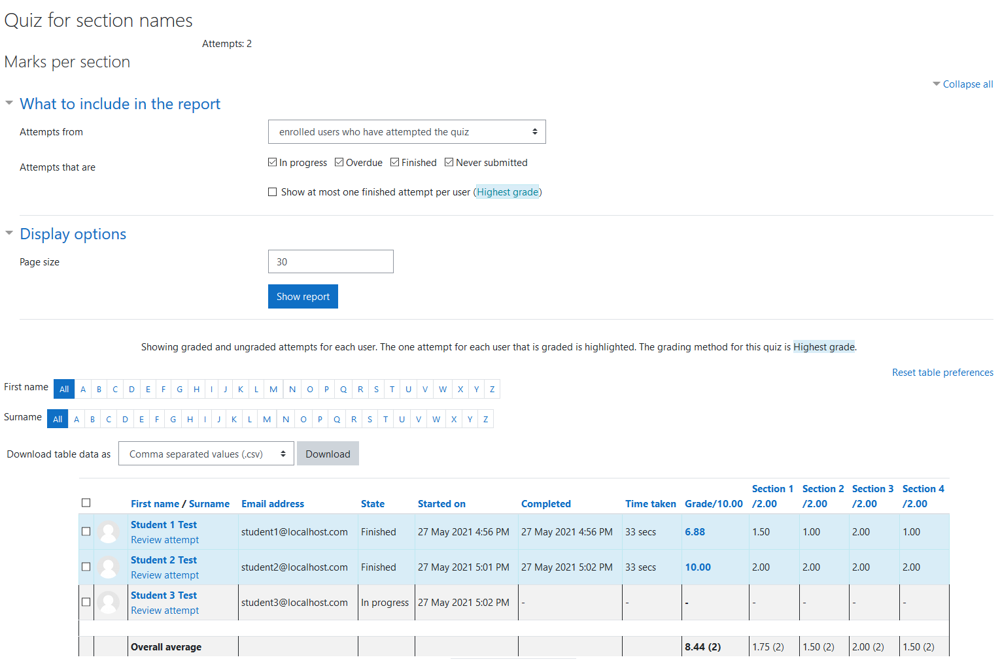
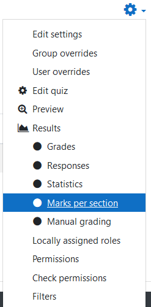
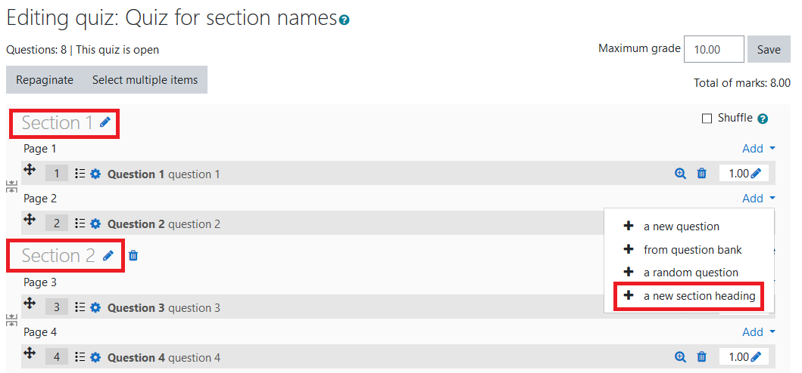

# moodle-quiz_markspersection

Quiz report plugin showing marks per section.

## The main view of the report
This report shows the marks for the sections of the quiz. Like other quiz reports, the teacher can filter attempts and users, change the number of attempts by page and order the table of results by any of its columns.

## Opening the report view
This report is available in the Actions menu of the quiz.

## Creating sections in a Quiz
For this report to work, the quiz needs to have some section headings.

